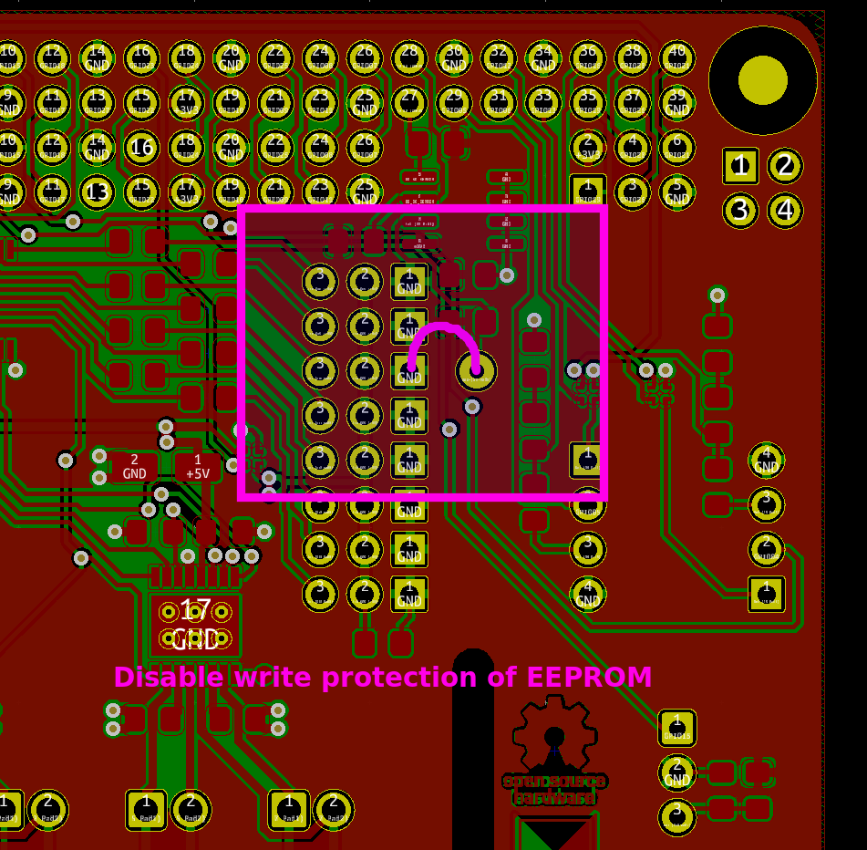

# HTL OOE HAT for Raspberry Pi
board schematic, layout and instructions on how to operate the board

## Installing the Operating System

### Downloading the Operating System
There are lots of operating Systems (Distributions) for the Raspberry Pi. Most of them are based on Linux.
The Foundation’s official supported operating system is [Raspberry Pi OS](https://www.raspberrypi.org/downloads/raspberry-pi-os/ "Raspberry Pi OS").
There are 3 Variants:
  * [Raspberry Pi OS with desktop and recommended software](https://downloads.raspberrypi.org/raspios_full_armhf_latest "Raspberry Pi OS full")
  * [Raspberry Pi OS with desktop](https://downloads.raspberrypi.org/raspios_armhf_latest "Raspberry Pi OS with Desktop")
  * [Raspberry Pi OS Lite (just Console, smallest in size)](hhttps://downloads.raspberrypi.org/raspios_lite_armhf_latest "Raspberry Pi OS Lite")

In our case [Raspberry Pi OS with desktop](https://downloads.raspberrypi.org/raspios_armhf_latest "Raspberry Pi OS with Desktop") is the the best choice.
You can not just copy the files to a Micro SD Card to install the Operating System. To boot Raspberry Pi OS you have to install the Operating System on the Micro SD Card.
Look at [Installing operating system images](https://www.raspberrypi.org/documentation/installation/installing-images/README.md "Installing operating system images") for how to do this. [balenaEtcher](https://www.balena.io/etcher/ "balena Etcher") installs itself to the Userprofile, take care of that when trying to use with different Accounts!
You will need administrative rights to format the Micro SD Card, so installing and using balena Etcher as Administrator is a good choice.
To be able to connect via ssh to the Raspberry Pi (headless) you can place the Files [ssh und wpa_supplicant.conf](https://www.raspberrypi.org/documentation/configuration/boot_folder.md "ssh und wpa_supplicant.conf") in the boot Folder of the Micro SD Card during the verify Cycle of  balena Etcher.
When using a SD Card to Micro SD Card Adapter, there is a Switch called **LOCK**. Take care, that the Switch is in the unlocked position (balena Etcher will tell you if the Micro SD Card is write protected).
When you access the Micro SD Card using Microsoft Windows, it asks for **formatting** the Device. **Don't do this!**
Now you can power up the Raspberry Pi with the plugged in Micro SD Card. If the Rasperry Pi is connected to a Monitor, you can you can read the Raspberry Pi's IP Address.
When you operate the Raspberry Pi headless you can use IP Scanners like the [Advanced IP Scanner](https://www.advanced-ip-scanner.com/ "Advanced IP Scanner") to get the IP Address.
Transfering Files is easy with [WinSCP](https://winscp.net/eng/download.php "WinSCP"). You can start a Terminal Program from within WinSCP itself or download [PuTTY](https://www.chiark.greenend.org.uk/~sgtatham/putty/latest.html "PuTTY").
When connected, you can enable **VNC** via
```console
pi@raspberrypi:~ $ sudo raspi-config
```
and use a Viewer like [VNC Viewer](https://www.realvnc.com/en/connect/download/viewer/ "VNC Viewer")

### Updating the Operating System and Installing Software

#### preparing APT for use with an Proxy
Create a new File called proxy.conf and edit it. You can use an Editor like **nano** or **vi**
```console
pi@raspberrypi:~ $ sudo touch /etc/apt/apt.conf.d/proxy.conf
pi@raspberrypi:~ $ sudo vi /etc/apt/apt.conf.d/proxy.conf
```
Add the following Lines to the empty File:
```code
Acquire {
  HTTP::proxy "http://proxy.htl-steyr.ac.at:8082/";
  HTTPS::proxy "https://proxy.htl-steyr.ac.at:8082/";
}
```
If you do not need the proxy (e.g. at home), you can just rename the File to disable the proxy:
```console
pi@raspberrypi:~ $ sudo mv /etc/apt/apt.conf.d/proxy.conf /etc/apt/apt.conf.d/proxy.conf.htl
```
#### Using APT
Using **apt-get** (Advanced Packaging Tool) you can update the Operating System and install Software.
The most important apt-get commands are:
| command | description |
| ----------- | ----------- |
| update | downloads the package lists from the repositories |
| upgrade | updates the list of available packages and their versions |
| install | installs one or more program package(s) |
| purge | removes a program package including the configuration|
apt-get needs the time and date to be set to an actual value! You can do this by typing
```console
pi@raspberrypi:~ $ sudo date -s "13 Jun 2020 09:20:00"
pi@raspberrypi:~ $ date # returns current time and date
```
If you have a ntp timeserver up and running you can edit
```console
pi@raspberrypi:~ $ sudo vi /etc/systemd/timesyncd.conf
```
to update the time via network.

To do the necessary software Maintenance you should enter
```console
pi@raspberrypi:~ $ sudo apt-get -y update && sudo apt-get -y dist-upgrade
```
Setting the Time Zone and enabling ntp (network time protocol)
```console
pi@raspberrypi:~ $ sudo timedatectl set-timezone Europe/Vienna
pi@raspberrypi:~ $ sudo timedatectl set-ntp true
```

## Device Tree
To manage ressources Linux uses the [Device Tree](https://www.raspberrypi.org/documentation/configuration/device-tree.md "Device Tree"). Parts of it are configured in the File [config.txt](https://www.raspberrypi.org/documentation/configuration/config-txt/README.md "config.txt").
You can also add devices via the EEPROM on a [HAT](https://github.com/raspberrypi/hats "HAT").
To configure devices [virtual Filesystems](https://en.wikipedia.org/wiki/Virtual_file_system "virtual Filesystems") (/dev, /sys, /proc) are frequently used.
### PWM
Our HAT uses PWM channels. The **root** user can access the onboard chanels.
If the user **pi** should use the pripheral, you have to give him the rights to do this:
Edit the File `/etc/udev/rules.d/99-com.rules`
```console
pi@raspberrypi:~ $ sudo vi /etc/udev/rules.d/99-com.rules
```
and change
```code
        chown -R root:gpio /sys/devices/platform/soc/*.pwm/pwm/pwmchip* && chmod -R 770 /sys/devices/platform/soc/*.pwm/pwm/pwmchip*\
```
to
```code
        chown -R root:gpio /sys/devices/platform/soc/*.pwm/pwm/pwmchip* && chmod -R 770 /sys/devices/platform/soc/*.pwm/pwm/pwmchip*;\
        chown -R root:gpio /sys/devices/platform/soc/*.i2c/i2c*/*/pwm/pwmchip* && chmod -R 770 /sys/devices/platform/soc/*.i2c/i2c*/*/pwm/pwmchip*\
```
mind the semicolon **;** to be added to the first Line!

Controlling the PWM Unit can be done in the virtual Filesystem `/sys/class/pwm/pwmchip*`.
When using **Python** [python-periphery](https://python-periphery.readthedocs.io/ "python-periphery") can access the PWM channels.
Keyboard, Mouse, Joysticks and Game Controllers can easily be accessed using [python-evdev](https://python-evdev.readthedocs.io/ "python-evdev")
#### Programing the HAT EEPROM
Download the latest Version of the **eepromutils** and compile the utils. You can also download the Repository (zip file) and unzip them in pi's homedirectory. Then you have to rename the directorys, so they do not contain "-master".
```console
pi@raspberrypi:~ $ sudo apt-get install -y git
pi@raspberrypi:~ $ git clone https://github.com/raspberrypi/hats.git
pi@raspberrypi:~ $ git clone https://github.com/htl-ooe/board.git
pi@raspberrypi:~ $ cd hats/eepromutils && make ; cd
```
```console
pi@raspberrypi:~ $ sudo dtc -@ -H epapr -O dtb -o "/boot/overlays/smartcar-V1-2.dtbo" -W no-unit_address_vs_reg './board/hat/smartcar-V1-2-overlay.dts'
```
compiles the device tree source file and copies it to `/boot/overlays`. You can test the overlayfile by adding the line
`dtoverlay=smartcar-V1-2` to [config.txt](https://www.raspberrypi.org/documentation/configuration/config-txt/README.md "config.txt")
```console
pi@raspberrypi:~ $ ./hats/eepromutils/eepmake ./board/hat/eeprom_settings-V1-2.txt ./board/hat/smartcar-V1-2.eep /boot/overlays/smartcar-V1-2.dtbo
```
generates the contents of the EEPROM

Disable the write protection with a piece of wire or calipers: 


```console
pi@raspberrypi:~ $ sudo ./hats/eepromutils/eepflash.sh -w -f=./board/hat/smartcar-V1-2.eep -t=24c512
```
writes smartcar-V1-2.eep to the EEPROM, assumed that you disabled the Write Protection and i2c-0 can be enabled. Propably you need dtparam=i2c_vc=on in [config.txt](https://www.raspberrypi.org/documentation/configuration/config-txt/README.md "config.txt").

#### Reboot
```
pi@raspberrypi:~ $ sudo reboot
```

## Ultrasonic Sensors
### Compile modules install toolchain and headers
```console
pi@raspberrypi:~ $ sudo apt-get install -y raspberrypi-kernel-headers
```
installs the header Files for the Kernel
```console
pi@raspberrypi:~ $ git clone https://github.com/htl-ooe/board.git
pi@raspberrypi:~ $ sudo /home/pi/board/drivers/install.sh
```
compiles the srf04.c File and copies it to the propper directory. When you did this once you can copy the compiled module to another Raspberry Pi and do not have to compile (download the rpi headers) again.
## IR Receiver
install ir-keytable
```console
pi@raspberrypi:~ $ sudo apt-get install -y ir-keytable
```
select the desired Protocol (templates: /lib/udev/rc_keymaps) eg: rc6_mce
```console
pi@raspberrypi:~ $ sudo ir-keytable -p rc-5,rc-5-sz,jvc,sony,nec,sanyo,mce_kbd,rc-6,sharp,xmp -w /lib/udev/rc_keymaps/rc6_mce.toml
```
to test type
```console
pi@raspberrypi:~ $ ir-keytable --test
```
to bind actions (triggers) to a IR Key edit eg. /etc/triggerhappy/triggers.d/power.conf (new File)
and add the line **KEY_POWER		1	sudo /sbin/halt** to shutdown with the power key
